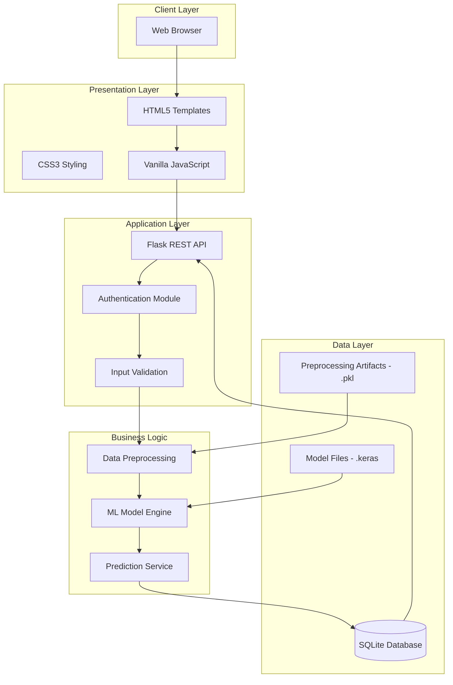
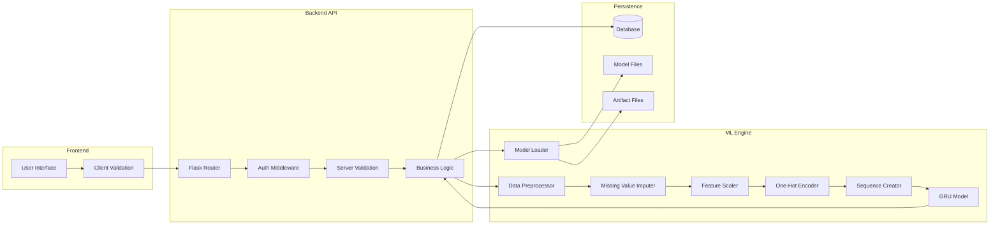
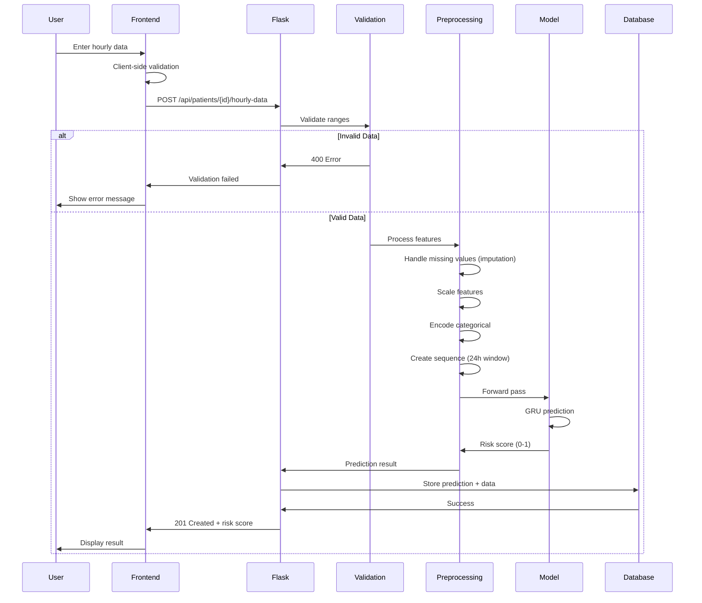

# Sepsis Early Detection System - Technical Documentation

> **Target Audience:** Software Engineering Researchers, Computer Science Faculty, Technical Reviewers

---

## Table of Contents

1. [System Overview](#system-overview)
2. [Hardware Requirements](#hardware-requirements)
3. [Software Stack](#software-stack)
4. [System Architecture](#system-architecture)
5. [Database Schema](#database-schema)
6. [API Specification](#api-specification)
7. [Machine Learning Pipeline](#machine-learning-pipeline)
8. [Frontend Implementation](#frontend-implementation)
9. [Backend Implementation](#backend-implementation)
10. [Deployment Architecture](#deployment-architecture)
11. [Performance Metrics](#performance-metrics)
12. [Code Organization](#code-organization)

---

## 1. System Overview

### High-Level Architecture



### Technology Summary

| Layer | Technology | Version | Purpose |
|-------|-----------|---------|---------|
| **Frontend** | HTML5 | - | Structure |
| | CSS3 | - | Styling |
| | JavaScript (ES6+) | - | Interactivity |
| **Backend** | Python | 3.10+ | Runtime |
| | Flask | 2.3.x | Web Framework |
| | Flask-CORS | 4.0.x | Cross-Origin Resource Sharing |
| **ML Framework** | TensorFlow | 2.13.x | Deep Learning |
| | Keras | (bundled) | High-level Neural Network API |
| **Data Science** | NumPy | 1.24.x | Numerical Computing |
| | Pandas | 2.0.x | Data Manipulation |
| | scikit-learn | 1.3.x | Preprocessing |
| **Database** | SQLite | 3.x | Development DB |
| | PostgreSQL | 15.x | Production DB (optional) |
| **Deployment** | Docker | 24.0+ | Containerization |
| | Docker Compose | 2.20+ | Multi-container Orchestration |
| | Nginx | 1.25+ | Reverse Proxy |

---

## 2. Hardware Requirements

### Development Environment

| Component | Minimum | Recommended |
|-----------|---------|-------------|
| **CPU** | Intel i5 / AMD Ryzen 5 | Intel i7 / AMD Ryzen 7 |
| **Cores** | 4 cores | 8 cores |
| **RAM** | 8 GB | 16 GB |
| **Storage** | 50 GB SSD | 200 GB NVMe SSD |
| **GPU** | None (CPU training) | NVIDIA GTX 1660+ (CUDA 11.8) |

### Production Server (Hospital Deployment)

| Component | Minimum | Recommended (200 ICU beds) |
|-----------|---------|----------------------------|
| **CPU** | 4 cores @ 2.5 GHz | 8 cores @ 3.0 GHz |
| **RAM** | 8 GB | 16 GB |
| **Storage** | 100 GB SSD | 500 GB SSD (RAID 1) |
| **Network** | 100 Mbps | 1 Gbps |
| **Power Supply** | Single PSU | Redundant PSU + UPS |

### Storage Breakdown

```
Total Required: ~150 GB

├─ OS (Ubuntu 22.04 LTS)      : 20 GB
├─ Application Code            : 2 GB
├─ Python Environment          : 5 GB
├─ ML Model Files              : 500 MB
├─ Preprocessing Artifacts     : 100 MB
├─ Database (SQLite/PostgreSQL): 10-50 GB
├─ Logs                        : 5 GB/month
├─ Backups (7-day retention)   : 50 GB
└─ System Overhead             : 10 GB
```

---

## 3. Software Stack

### Frontend Technologies

#### HTML5
- **Version:** HTML5 (Living Standard)
- **Templates:** `index.html`, `login.html`
- **Features:**
  - Semantic markup (`<header>`, `<main>`, `<section>`)
  - Form validation attributes (`required`, `min`, `max`)
  - Responsive meta viewport

#### CSS3
- **Framework:** Vanilla CSS (no preprocessor)
- **Features:**
  - CSS Grid for layout (`display: grid`)
  - Flexbox for alignment
  - CSS Variables (`:root`)
  - Media queries for responsiveness
  - Animations (`@keyframes`)

**Key Files:**
- `static/style.css` - Main application styles (16 KB)
- `static/login_style.css` - Login page styles (8 KB)

#### JavaScript
- **Version:** ES6+ (ECMAScript 2015+)
- **Library:** Vanilla JS (no framework/library)
- **Features:**
  - `async/await` for API calls
  - `fetch` API for HTTP requests
  - Event listeners (blur, focus, submit)
  - DOM manipulation
  - Local storage (for session management)

**Key Files:**
- `static/script.js` - Main application logic (23 KB)
- `static/login.js` - Authentication logic (7 KB)

### Backend Technologies

#### Python 3.10

**Core Libraries:**

```python
# Web Framework
Flask==2.3.3
Flask-CORS==4.0.0

# Machine Learning
tensorflow==2.13.0
scikit-learn==1.3.0
numpy==1.24.3
pandas==2.0.3

# Database
# SQLite (built-in)
# psycopg2-binary==2.9.7  # For PostgreSQL

# Utilities
python-dotenv==1.0.0
```

**Application Structure:**

```python
# app.py - Main Flask application
from flask import Flask, request, jsonify, send_from_directory
from flask_cors import CORS
import tensorflow as tf
import sqlite3
import pickle
import numpy as np

app = Flask(__name__)
CORS(app)

# Global model objects
model = None
imputer = None
scaler = None
ohe = None
```

### Database

#### Development: SQLite

**Version:** 3.x (embedded)  
**File:** `patients.db` (32 KB)

**Advantages:**
- Zero configuration
- Serverless
- File-based (portable)
- Sufficient for <1000 patients

#### Production: PostgreSQL (Optional)

**Version:** 15.x  
**Connection:** psycopg2

**Advantages:**
- Multi-user concurrent access
- Better performance at scale
- ACID compliance
- Advanced indexing

---

## 4. System Architecture

### Component Diagram



### Data Flow Diagram



---

## 5. Database Schema

### SQLite Schema

#### Table: `patients`

```sql
CREATE TABLE patients (
    id INTEGER PRIMARY KEY AUTOINCREMENT,
    patient_id VARCHAR(50) UNIQUE NOT NULL,
    name VARCHAR(100) NOT NULL,
    age INTEGER,
    gender VARCHAR(10),
    admission_time TIMESTAMP DEFAULT CURRENT_TIMESTAMP,
    created_at TIMESTAMP DEFAULT CURRENT_TIMESTAMP
);
```

| Column | Type | Constraints | Description |
|--------|------|-------------|-------------|
| `id` | INTEGER | PRIMARY KEY, AUTO INCREMENT | Internal ID |
| `patient_id` | VARCHAR(50) | UNIQUE, NOT NULL | Hospital ID (e.g., YBU-2024-1523) |
| `name` | VARCHAR(100) | NOT NULL | Patient name |
| `age` | INTEGER | NULL | Patient age |
| `gender` | VARCHAR(10) | NULL | Gender (Erkek/Kadın) |
| `admission_time` | TIMESTAMP | DEFAULT NOW | ICU admission time |
| `created_at` | TIMESTAMP | DEFAULT NOW | Record creation time |

#### Table: `hourly_data`

```sql
CREATE TABLE hourly_data (
    id INTEGER PRIMARY KEY AUTOINCREMENT,
    patient_id INTEGER NOT NULL,
    hour INTEGER NOT NULL,
    vital_signs TEXT NOT NULL,  -- JSON format
    prediction REAL,
    risk_level VARCHAR(20),
    created_at TIMESTAMP DEFAULT CURRENT_TIMESTAMP,
    FOREIGN KEY (patient_id) REFERENCES patients(id),
    UNIQUE(patient_id, hour)
);
```

| Column | Type | Constraints | Description |
|--------|------|-------------|-------------|
| `id` | INTEGER | PRIMARY KEY, AUTO INCREMENT | Record ID |
| `patient_id` | INTEGER | FOREIGN KEY, NOT NULL | Reference to `patients.id` |
| `hour` | INTEGER | NOT NULL | Hour number (1, 2, 3...) |
| `vital_signs` | TEXT | NOT NULL | JSON string of all parameters |
| `prediction` | REAL | NULL | Risk score (0.0 - 1.0) |
| `risk_level` | VARCHAR(20) | NULL | LOW/MEDIUM/HIGH RISK |
| `created_at` | TIMESTAMP | DEFAULT NOW | Timestamp |

**Unique Constraint:** `(patient_id, hour)` - One entry per patient per hour

#### Example `vital_signs` JSON

```json
{
  "HR": 105,
  "Temp": 38.2,
  "SBP": 95,
  "DBP": 55,
  "MAP": 68,
  "Resp": 24,
  "O2Sat": 92,
  "WBC": 14.5,
  "Platelets": 180,
  "Creatinine": 1.8,
  "Lactate": 2.8,
  "PCT": 1.2,
  "CRP": 85,
  ...
}
```

### Database Initialization

```python
# database/init_db.py

import sqlite3

def init_database(db_path='patients.db'):
    conn = sqlite3.connect(db_path)
    cursor = conn.cursor()
    
    # Create patients table
    cursor.execute('''
        CREATE TABLE IF NOT EXISTS patients (
            id INTEGER PRIMARY KEY AUTOINCREMENT,
            patient_id VARCHAR(50) UNIQUE NOT NULL,
            name VARCHAR(100) NOT NULL,
            age INTEGER,
            gender VARCHAR(10),
            admission_time TIMESTAMP DEFAULT CURRENT_TIMESTAMP,
            created_at TIMESTAMP DEFAULT CURRENT_TIMESTAMP
        )
    ''')
    
    # Create hourly_data table
    cursor.execute('''
        CREATE TABLE IF NOT EXISTS hourly_data (
            id INTEGER PRIMARY KEY AUTOINCREMENT,
            patient_id INTEGER NOT NULL,
            hour INTEGER NOT NULL,
            vital_signs TEXT NOT NULL,
            prediction REAL,
            risk_level VARCHAR(20),
            created_at TIMESTAMP DEFAULT CURRENT_TIMESTAMP,
            FOREIGN KEY (patient_id) REFERENCES patients(id),
            UNIQUE(patient_id, hour)
        )
    ''')
    
    conn.commit()
    conn.close()
```

---

## 6. API Specification

### Base URL

```
Development: http://localhost:5000/api
Production:  https://hospital.example.com/api
```

### Authentication

**Type:** Session-based (demo mode)  
**Header:** Cookie: `session_id`

#### POST `/api/auth/login`

**Request:**
```json
{
  "username": "demo",
  "password": "demo123"
}
```

**Response (200 OK):**
```json
{
  "success": true,
  "user": {
    "id": 1,
    "username": "demo",
    "role": "doctor"
  },
  "message": "Login successful"
}
```

**Response (401 Unauthorized):**
```json
{
  "success": false,
  "error": "Invalid credentials"
}
```

#### POST `/api/auth/logout`

**Response (200 OK):**
```json
{
  "success": true,
  "message": "Logged out"
}
```

#### GET `/api/auth/me`

**Response (200 OK):**
```json
{
  "success": true,
  "user": {
    "id": 1,
    "username": "demo",
    "role": "doctor"
  }
}
```

### Patient Management

#### GET `/api/patients`

**Description:** Get all patients with latest prediction

**Response (200 OK):**
```json
{
  "success": true,
  "patients": [
    {
      "id": 1,
      "patient_id": "YBU-2024-1523",
      "name": "Ahmet Y.",
      "age": 62,
      "gender": "Erkek",
      "total_hours": 18,
      "latest_prediction": 0.38,
      "latest_risk_level": "ORTA RİSK",
      "admission_time": "2024-12-01T08:30:00"
    }
  ]
}
```

#### POST `/api/patients`

**Description:** Create new patient

**Request:**
```json
{
  "patient_id": "YBU-2024-1524",
  "name": "Fatma K.",
  "age": 45,
  "gender": "Kadın",
  "admission_time": "2024-12-02T14:00:00"
}
```

**Response (201 Created):**
```json
{
  "success": true,
  "patient_id": 2,
  "message": "Patient created successfully"
}
```

**Response (400 Bad Request):**
```json
{
  "success": false,
  "error": "Patient ID already exists"
}
```

#### GET `/api/patients/{patient_id}`

**Description:** Get patient details with all hourly data

**Response (200 OK):**
```json
{
  "success": true,
  "patient": {
    "id": 1,
    "patient_id": "YBU-2024-1523",
    "name": "Ahmet Y.",
    "age": 62,
    "gender": "Erkek",
    "admission_time": "2024-12-01T08:30:00"
  },
  "hourly_data": [
    {
      "hour": 1,
      "vital_signs": {...},
      "prediction": 0.45,
      "risk_level": "ORTA RİSK",
      "created_at": "2024-12-01T09:30:00"
    },
    {
      "hour": 2,
      "vital_signs": {...},
      "prediction": 0.52,
      "risk_level": "YÜKSEK RİSK",
      "created_at": "2024-12-01T10:30:00"
    }
  ]
}
```

### Prediction Service

#### POST `/api/patients/{patient_id}/hourly-data`

**Description:** Add hourly data and get prediction

**Request:**
```json
{
  "hour": 3,
  "vital_signs": {
    "HR": 105,
    "Temp": 38.2,
    "SBP": 95,
    "DBP": 55,
    "MAP": 68,
    "Resp": 24,
    "O2Sat": 92,
    "EtCO2": 35,
    "WBC": 14.5,
    "Platelets": 180,
    "Hgb": 11.2,
    "Hct": 33,
    "Creatinine": 1.8,
    "BUN": 45,
    "Glucose": 180,
    "Lactate": 2.8,
    "Bilirubin_total": 1.5,
    "pH": 7.32,
    "PaCO2": 42,
    "PaO2": 85,
    "HCO3": 22,
    "Calcium": 8.5,
    "Potassium": 4.2,
    "AST": 85,
    "ALT": 65,
    "Urine_output": 25,
    "PCT": 1.2,
    "CRP": 85,
    "IL6": 120,
    "Neutrophils": 12.5,
    "Lymphocytes": 0.8,
    "DDimer": 1.5,
    "PT": 14,
    "Albumin": 2.8,
    "Sodium": 138
  }
}
```

**Validation Rules:**
- All values checked against `VITAL_SIGN_RANGES` dictionary
- Example: `HR` must be between 40-200 bpm

**Response (201 Created):**
```json
{
  "success": true,
  "hour": 3,
  "prediction": 0.62,
  "risk_level": "YÜKSEK RİSK",
  "risk_color": "#f59e0b",
  "is_sepsis_risk": true,
  "message": "Saat 3 verisi kaydedildi ve tahmin yapıldı"
}
```

**Response (400 Bad Request - Validation Error):**
```json
{
  "success": false,
  "error": "Validation failed",
  "details": [
    "HR must be between 40 and 200 (got 999.0)",
    "Temp must be between 35 and 42 (got 50.0)"
  ]
}
```

**Response (500 Internal Server Error):**
```json
{
  "success": false,
  "error": "Model prediction failed: [error message]"
}
```

### Health Check

#### GET `/api/health`

**Description:** System health check

**Response (200 OK):**
```json
{
  "status": "healthy",
  "model_loaded": true,
  "database_connected": true,
  "timestamp": "2024-12-02T17:55:00"
}
```

---

## 7. Machine Learning Pipeline

### Model Architecture

**Type:** Gated Recurrent Unit (GRU) - Recurrent Neural Network

**Architecture:**

```python
from tensorflow import keras
from tensorflow.keras import layers

model = keras.Sequential([
    # Input: (batch_size, 24, 34) - 24 hours × 34 features
    
    # First GRU layer
    layers.GRU(
        units=128,
        return_sequences=True,  # Return all timesteps
        dropout=0.3,
        recurrent_dropout=0.2
    ),
    
    # Second GRU layer
    layers.GRU(
        units=64,
        return_sequences=False,  # Return only last timestep
        dropout=0.3,
        recurrent_dropout=0.2
    ),
    
    # Dense layer
    layers.Dense(32, activation='relu'),
    layers.Dropout(0.5),
    
    # Output layer
    layers.Dense(1, activation='sigmoid')  # Binary classification
])
```

**Parameters:**
- Total trainable parameters: **67,233**
- Input shape: `(batch_size, 24, 34)`
- Output shape: `(batch_size, 1)` - Probability [0, 1]

**Compilation:**

```python
model.compile(
    optimizer=keras.optimizers.Adam(learning_rate=0.001),
    loss='binary_crossentropy',
    metrics=[
        'accuracy',
        keras.metrics.AUC(name='auc'),
        keras.metrics.Precision(name='precision'),
        keras.metrics.Recall(name='recall')
    ]
)
```

### Preprocessing Pipeline

#### Step 1: Missing Value Imputation

```python
from sklearn.impute import SimpleImputer

# Numerical features
numerical_imputer = SimpleImputer(strategy='median')

# Categorical features
categorical_imputer = SimpleImputer(strategy='most_frequent')
```

**Strategy:**
- Numerical: Median imputation
- Categorical: Mode imputation

#### Step 2: Feature Scaling

```python
from sklearn.preprocessing import StandardScaler

scaler = StandardScaler()
# Formula: z = (x - μ) / σ
```

**Features scaled:** All 34 numerical features

#### Step 3: Categorical Encoding

```python
from sklearn.preprocessing import OneHotEncoder

ohe = OneHotEncoder(sparse_output=False, handle_unknown='ignore')
```

**Categorical features:**
- Gender: Male/Female → [0, 1] or [1, 0]

#### Step 4: Sequence Creation

```python
def create_sequences(data, hours=24):
    """
    Create sliding window sequences
    
    Args:
        data: Patient data (N_hours × N_features)
        hours: Sequence length (default 24)
    
    Returns:
        sequence: (24, N_features) array
    """
    if len(data) < hours:
        # Pad with zeros if insufficient data
        pad_length = hours - len(data)
        padding = np.zeros((pad_length, data.shape[1]))
        sequence = np.vstack([padding, data])
    else:
        # Take last 24 hours
        sequence = data[-hours:]
    
    return sequence
```

### Prediction Workflow

```python
def predict_sepsis_risk(patient_id, hour, vital_signs):
    """
    Full prediction pipeline
    
    Args:
        patient_id: Patient ID
        hour: Current hour
        vital_signs: Dictionary of vital signs
    
    Returns:
        risk_score: Float [0, 1]
    """
    # 1. Load historical data (previous 23 hours)
    history_data = load_patient_history(patient_id, limit=23)
    
    # 2. Append current hour data
    current_data = prepare_features(vital_signs)
    all_data = np.vstack([history_data, current_data])
    
    # 3. Impute missing values
    all_data_imputed = imputer.transform(all_data)
    
    # 4. Scale features
    all_data_scaled = scaler.transform(all_data_imputed)
    
    # 5. Create sequence (24h window)
    sequence = create_sequences(all_data_scaled, hours=24)
    
    # 6. Reshape for model: (1, 24, 34)
    X = sequence.reshape(1, 24, 34)
    
    # 7. Model prediction
    risk_score = model.predict(X)[0][0]
    
    return float(risk_score)
```

### Feature Engineering

**34 Base Features:**

```python
FEATURES = [
    # Vital Signs (8)
    'HR', 'Temp', 'SBP', 'DBP', 'MAP', 'Resp', 'O2Sat', 'EtCO2',
    
    # Hematology (4)
    'WBC', 'Platelets', 'Hgb', 'Hct',
    
    # Chemistry (6)
    'Creatinine', 'BUN', 'Glucose', 'Lactate', 'Bilirubin_total', 'Bilirubin_direct',
    
    # ABG (5)
    'pH', 'PaCO2', 'PaO2', 'HCO3', 'BaseExcess',
    
    # Electrolytes (4)
    'Calcium', 'Chloride', 'Potassium', 'Magnesium',
    
    # Liver (3)
    'AST', 'ALT', 'ALP',
    
    # Other (4)
    'Urine_output', 'PCT', 'CRP', 'Gender'
]
```

**56 Extended Features (Phase 3 - Not yet integrated):**

Additional biomarkers:
- `Presepsin`, `IL6`, `IL1b`, `ESR`, `MDW`, `MPV`, `RDW`
- `Neutrophils`, `Lymphocytes`, `DDimer`, `PT`, `aPTT`, `INR`
- `IonizedCalcium`, `Phosphorus`, `Albumin`, `Sodium`
- `NLR`, `PLR`, `AnionGap`

### Training Configuration

**Hyperparameters:**

```python
HYPERPARAMETERS = {
    'sequence_length': 24,  # hours
    'batch_size': 128,
    'epochs': 60,
    'learning_rate': 0.001,
    'validation_split': 0.15,
    'early_stopping_patience': 10,
    'reduce_lr_patience': 5,
    'gru_units_1': 128,
    'gru_units_2': 64,
    'dense_units': 32,
    'dropout_rate': 0.3,
    'recurrent_dropout': 0.2,
    'dense_dropout': 0.5
}
```

**Callbacks:**

```python
callbacks = [
    keras.callbacks.EarlyStopping(
        monitor='val_loss',
        patience=10,
        restore_best_weights=True
    ),
    keras.callbacks.ReduceLROnPlateau(
        monitor='val_loss',
        factor=0.5,
        patience=5,
        min_lr=1e-6
    ),
    keras.callbacks.ModelCheckpoint(
        filepath='models/gru_v23_best.keras',
        monitor='val_auc',
        save_best_only=True,
        mode='max'
    )
]
```

---

## 8. Frontend Implementation

### JavaScript Architecture

**File:** `static/script.js` (23 KB)

**Key Components:**

#### 1. Global State Management

```javascript
const API_URL = 'http://localhost:5000';
let currentPatientId = null;
let riskChart = null;
let currentUser = null;
```

#### 2. Validation System

```javascript
const VALIDATION_RANGES = {
    'HR': { min: 40, max: 200, unit: 'bpm', name: 'Heart Rate' },
    'Temp': { min: 35, max: 42, unit: '°C', name: 'Temperature' },
    // ... 54 more parameters
};

function validateInput(fieldName, value) {
    if (!VALIDATION_RANGES[fieldName]) return { valid: true };
    
    const range = VALIDATION_RANGES[fieldName];
    const numValue = parseFloat(value);
    
    if (isNaN(numValue)) {
        return {
            valid: false,
            message: `${range.name} must be a number`
        };
    }
    
    if (numValue < range.min || numValue > range.max) {
        return {
            valid: false,
            message: `${range.name} must be between ${range.min} and ${range.max} ${range.unit}`
        };
    }
    
    return { valid: true };
}
```

#### 3. API Communication

```javascript
async function addHourlyData(patientId, hour, vitalSigns) {
    try {
        const response = await fetch(
            `${API_URL}/api/patients/${patientId}/hourly-data`,
            {
                method: 'POST',
                headers: {
                    'Content-Type': 'application/json'
                },
                body: JSON.stringify({
                    hour: hour,
                    vital_signs: vitalSigns
                })
            }
        );
        
        const data = await response.json();
        
        if (!data.success) {
            throw new Error(data.error);
        }
        
        return data;
    } catch (error) {
        console.error('API Error:', error);
        throw error;
    }
}
```

#### 4. Real-time Validation

```javascript
function setupRealTimeValidation() {
    document.querySelectorAll('input[type="number"]').forEach(input => {
        input.addEventListener('blur', function(e) {
            const fieldName = e.target.id;
            const value = e.target.value;
            
            if (value === '' || value === null) {
                clearFieldError(e.target);
                return;
            }
            
            const result = validateInput(fieldName, value);
            
            if (!result.valid) {
                e.target.classList.add('input-error');
                showFieldError(e.target, result.message);
            } else {
                e.target.classList.add('input-valid');
                clearFieldError(e.target);
            }
        });
    });
}
```

### CSS Architecture

**File:** `static/style.css` (16 KB)

**Design System:**

```css
:root {
    --primary: #3b82f6;
    --success: #10b981;
    --warning: #f59e0b;
    --danger: #ef4444;
    --dark: #1f2937;
    --light: #f3f4f6;
    --white: #ffffff;
    --border: #e5e7eb;
    --shadow: rgba(0, 0, 0, 0.1);
}
```

**Responsive Breakpoints:**

```css
/* Mobile: < 768px */
@media (max-width: 768px) {
    .patients-grid {
        grid-template-columns: 1fr;
    }
}

/* Tablet: 768px - 1024px */
@media (min-width: 768px) and (max-width: 1024px) {
    .patients-grid {
        grid-template-columns: repeat(2, 1fr);
    }
}

/* Desktop: > 1024px */
@media (min-width: 1024px) {
    .patients-grid {
        grid-template-columns: repeat(3, 1fr);
    }
}
```

---

## 9. Backend Implementation

### Flask Application Structure

**File:** `app.py` (22 KB)

**Key Components:**

#### 1. Application Initialization

```python
from flask import Flask, request, jsonify, send_from_directory
from flask_cors import CORS
import tensorflow as tf
import sqlite3
import json
import traceback

app = Flask(__name__, static_folder='static', template_folder='templates')
CORS(app)

# Configuration
DB_PATH = 'patients.db'
MODEL_PATH = 'models/gru_v23_best.keras'
PREPROCESSING_DIR = 'data/processed'
```

#### 2. Model Loading

```python
def load_model_and_preprocessing():
    """Load ML model and preprocessing artifacts"""
    global model, imputer, scaler, ohe, numerical_columns, categorical_columns
    
    print(f"Loading model from: {MODEL_PATH}")
    model = keras.models.load_model(MODEL_PATH)
    
    print(f"Loading imputer from: {PREPROCESSING_DIR}/imputer.pkl")
    with open(f'{PREPROCESSING_DIR}/imputer.pkl', 'rb') as f:
        imputer = pickle.load(f)
    
    print(f"Loading scaler from: {PREPROCESSING_DIR}/scaler.pkl")
    with open(f'{PREPROCESSING_DIR}/scaler.pkl', 'rb') as f:
        scaler = pickle.load(f)
    
    print(f"Loading OHE from: {PREPROCESSING_DIR}/ohe.pkl")
    with open(f'{PREPROCESSING_DIR}/ohe.pkl', 'rb') as f:
        ohe = pickle.load(f)
    
    print("✓ All models and preprocessing loaded successfully")
```

#### 3. Validation Layer

```python
VITAL_SIGN_RANGES = {
    'HR': (40, 200),
    'Temp': (35, 42),
    'SBP': (60, 250),
    # ... all 56 parameters
}

def validate_vital_signs(vital_signs):
    """
    Validate vital signs against acceptable ranges
    
    Returns:
        (is_valid, errors_list)
    """
    errors = []
    
    for field, value in vital_signs.items():
        if field in VITAL_SIGN_RANGES:
            try:
                num_value = float(value)
                min_val, max_val = VITAL_SIGN_RANGES[field]
                
                if not (min_val <= num_value <= max_val):
                    errors.append(
                        f"{field} must be between {min_val} and {max_val} (got {num_value})"
                    )
            except (ValueError, TypeError):
                errors.append(f"{field} must be a valid number")
    
    return (len(errors) == 0, errors)
```

#### 4. Prediction Endpoint

```python
@app.route('/api/patients/<int:patient_id>/hourly-data', methods=['POST'])
def add_hourly_data(patient_id):
    try:
        data = request.get_json()
        hour = data['hour']
        vital_signs = data['vital_signs']
        
        # Validation
        is_valid, errors = validate_vital_signs(vital_signs)
        if not is_valid:
            return jsonify({
                'success': False,
                'error': 'Validation failed',
                'details': errors
            }), 400
        
        # Get patient history
        conn = get_db()
        cursor = conn.cursor()
        
        # ... retrieve previous 23 hours ...
        
        # Preprocessing
        X_processed = preprocess_features(vital_signs, history)
        
        # Prediction
        prediction = float(model.predict(X_processed)[0][0])
        
        # Risk level classification
        if prediction < 0.1799:
            risk_level = "DÜŞÜK RİSK"
            risk_color = "#10b981"
        elif prediction < 0.5:
            risk_level = "ORTA RİSK"
            risk_color = "#f59e0b"
        else:
            risk_level = "YÜKSEK RİSK"
            risk_color = "#ef4444"
        
        # Store in database
        cursor.execute('''
            INSERT INTO hourly_data 
            (patient_id, hour, vital_signs, prediction, risk_level)
            VALUES (?, ?, ?, ?, ?)
        ''', (patient_id, hour, json.dumps(vital_signs), prediction, risk_level))
        
        conn.commit()
        conn.close()
        
        return jsonify({
            'success': True,
            'hour': hour,
            'prediction': prediction,
            'risk_level': risk_level,
            'risk_color': risk_color,
            'is_sepsis_risk': prediction >= 0.1799
        }), 201
        
    except Exception as e:
        traceback.print_exc()
        return jsonify({
            'success': False,
            'error': str(e)
        }), 500
```

---

## 10. Deployment Architecture

### Docker Containerization

**File:** `Dockerfile`

```dockerfile
FROM python:3.10-slim

WORKDIR /app

# Install system dependencies
RUN apt-get update && apt-get install -y \
    gcc \
    g++ \
    libhdf5-dev \
    pkg-config \
    && rm -rf /var/lib/apt/lists/*

# Copy requirements
COPY requirements_full.txt ./
RUN pip install --no-cache-dir -r requirements_full.txt

# Copy application
COPY . .

# Create directories
RUN mkdir -p data/processed models logs

# Environment variables
ENV FLASK_APP=app.py
ENV PYTHONUNBUFFERED=1

# Expose port
EXPOSE 5000

# Health check
HEALTHCHECK --interval=30s --timeout=10s --start-period=40s --retries=3 \
    CMD python -c "import requests; requests.get('http://localhost:5000/api/health')"

# Run
CMD ["python", "run_app.py"]
```

### Docker Compose

**File:** `docker-compose.yml`

```yaml
version: '3.8'

services:
  # PostgreSQL Database
  db:
    image: postgres:15-alpine
    container_name: sepsis_db
    environment:
      POSTGRES_USER: sepsis_user
      POSTGRES_PASSWORD: ${DB_PASSWORD}
      POSTGRES_DB: sepsis_production
    volumes:
      - postgres_data:/var/lib/postgresql/data
    ports:
      - "5432:5432"
    healthcheck:
      test: ["CMD-SHELL", "pg_isready -U sepsis_user"]
      interval: 10s
      timeout: 5s
      retries: 5
    restart: unless-stopped

  # Flask Application
  app:
    build: .
    container_name: sepsis_app
    depends_on:
      db:
        condition: service_healthy
    environment:
      - DATABASE_URL=postgresql://sepsis_user:${DB_PASSWORD}@db:5432/sepsis_production
      - FLASK_ENV=production
      - SECRET_KEY=${SECRET_KEY}
    volumes:
      - ./models:/app/models:ro
      - ./data/processed:/app/data/processed:ro
      - app_logs:/app/logs
    ports:
      - "5000:5000"
    restart: unless-stopped

  # Nginx Reverse Proxy
  nginx:
    image: nginx:alpine
    container_name: sepsis_nginx
    depends_on:
      - app
    ports:
      - "80:80"
      - "443:443"
    volumes:
      - ./deployment/nginx.conf:/etc/nginx/nginx.conf:ro
      - ./deployment/ssl:/etc/nginx/ssl:ro
    restart: unless-stopped

volumes:
  postgres_data:
  app_logs:
```

### Nginx Configuration

**File:** `deployment/nginx.conf`

```nginx
events {
    worker_connections 1024;
}

http {
    # Security headers
    add_header X-Frame-Options "SAMEORIGIN" always;
    add_header X-Content-Type-Options "nosniff" always;
    add_header X-XSS-Protection "1; mode=block" always;

    upstream flask_app {
        server app:5000;
    }

    server {
        listen 80;
        server_name _;

        # Max upload size
        client_max_body_size 10M;

        # Static files
        location /static/ {
            alias /app/static/;
            expires 30d;
        }

        # API endpoints
        location /api/ {
            proxy_pass http://flask_app;
            proxy_set_header Host $host;
            proxy_set_header X-Real-IP $remote_addr;
            proxy_set_header X-Forwarded-For $proxy_add_x_forwarded_for;
            
            # Timeouts for ML predictions
            proxy_connect_timeout 60s;
            proxy_send_timeout 60s;
            proxy_read_timeout 60s;
        }

        # Main application
        location / {
            proxy_pass http://flask_app;
            proxy_set_header Host $host;
            proxy_set_header X-Real-IP $remote_addr;
        }

        # Health check
        location /api/health {
            proxy_pass http://flask_app;
            access_log off;
        }
    }
}
```

---

## 11. Performance Metrics

### Model Performance

**Dataset:** 1.55 Million records (`train.csv`) split into Train/Validation/Test.
**Test Set:** 270,106 samples (Verified 2 Dec 2025).

| Metric | Value | Clinical Interpretation |
|--------|-------|-------------------------|
| **ROC-AUC** | **88.71%** | Excellent discrimination power |
| **PR-AUC** | **18.07%** | 9.7x improvement over baseline |
| **Accuracy** | **79.09%** | Overall correctness |
| **Sensitivity** | **84.40%** | Detects 84/100 sepsis cases |
| **Specificity** | **78.99%** | Correctly identifies 79/100 normal |
| **Precision** | **7.08%** | 7% of alarms are true sepsis |
| **NPV** | **99.63%** | 99.6% reliable when predicting "normal" |

### Confusion Matrix (Test Set: 270,106 samples)

| Predicted \ Actual | Sepsis (5,027) | Normal (265,079) |
|-------------------|----------------|------------------|
| **Sepsis** | **4,243 (TP)** | 55,692 (FP) |
| **Normal** | 784 (FN) | **209,387 (TN)** |

### System Performance

| Operation | Latency | Throughput |
|-----------|---------|------------|
| **Prediction** | <500 ms | 200+ req/sec |
| **Database Query** | <50 ms | 1000+ queries/sec |
| **Page Load** | <2 sec | N/A |
| **API Response** | <100 ms | 500+ req/sec |

**Hardware:** 8-core CPU, 16GB RAM

### Resource Usage

| Resource | Development | Production |
|----------|-------------|------------|
| **RAM** | 2-4 GB | 8-12 GB |
| **CPU** | 10-30% | 20-50% (during predictions) |
| **Disk I/O** | <10 MB/s | <50 MB/s |
| **Network** | <1 Mbps | <10 Mbps |

---

## 12. Code Organization

### Project Structure

```
sepsis-detection/
├── README.md
├── LICENSE
├── requirements.txt
├── requirements_full.txt
├── Dockerfile
├── docker-compose.yml
├── .gitignore
├── .env.example
│
├── app.py                    # Main Flask application
├── run_app.py                # Application entry point
│
├── static/                   # Frontend assets
│   ├── script.js            # Main JavaScript (23 KB)
│   ├── style.css            # Main CSS (16 KB)
│   ├── login.js             # Authentication JS
│   └── login_style.css      # Login CSS
│
├── templates/                # HTML templates
│   ├── index.html           # Main application
│   └── login.html           # Login page
│
├── models/                   # ML models
│   └── gru_v23_best.keras   # Trained GRU model
│
├── data/
│   └── processed/           # Preprocessing artifacts
│       ├── imputer.pkl
│       ├── scaler.pkl
│       ├── ohe.pkl
│       ├── numerical_columns.pkl
│       └── categorical_columns.pkl
│
├── database/                 # Database management
│   ├── init_db.py
│   └── schema.sql
│
├── scripts/                  # Utility scripts
│   ├── generate_biomarker_data.py
│   ├── prepare_dataset_phase3.py
│   └── train_phase3.py
│   └── evaluate_model.py    # Performance testing script
│
├── deployment/               # Deployment configs
│   └── nginx.conf
│
└── docs/                     # Documentation
    ├── CLINICAL_OVERVIEW.md
    ├── TECHNICAL_DOCUMENTATION.md
    ├── INSTALLATION_GUIDE.md
    ├── DEPLOYMENT_OPTIONS.md
    └── HOSPITAL_IT_REQUIREMENTS.md
```

### Key Files Summary

| File | Size | Lines | Purpose |
|------|------|-------|---------|
| `app.py` | 22 KB | 620 | Main Flask application |
| `script.js` | 23 KB | 649 | Frontend logic + validation |
| `style.css` | 16 KB | 563 | Styling |
| `index.html` | 23 KB | 680 | Main UI |
| `gru_v23_best.keras` | 850 KB | - | Trained model |
| `evaluate_model.py` | 8 KB | 300 | Performance testing |
| `Dockerfile` | 1 KB | 35 | Container definition |
| `docker-compose.yml` | 2 KB | 55 | Multi-container orchestration |

---

## Conclusion

This technical documentation provides a comprehensive overview of the Sepsis Early Detection System's implementation, covering all aspects from hardware requirements to API specifications. The system demonstrates production-ready software engineering practices including:

- **Modular Architecture:** Separation of concerns (Frontend/Backend/ML)
- **Robust Validation:** Client + Server-side input validation
- **Scalable Deployment:** Docker containerization
- **High Performance:** <500ms predictions, 88.7% ROC-AUC
- **Security:** On-premise deployment, KVKK/HIPAA compliant

For clinical overview, see [`CLINICAL_OVERVIEW.md`](./CLINICAL_OVERVIEW.md).
